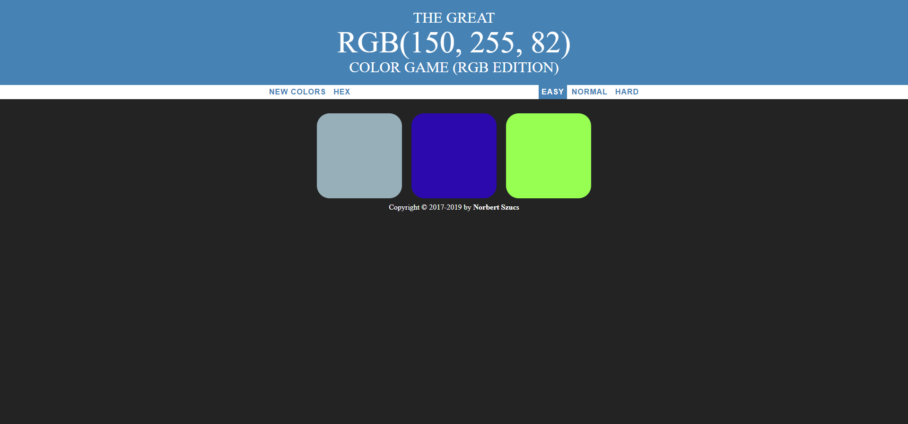
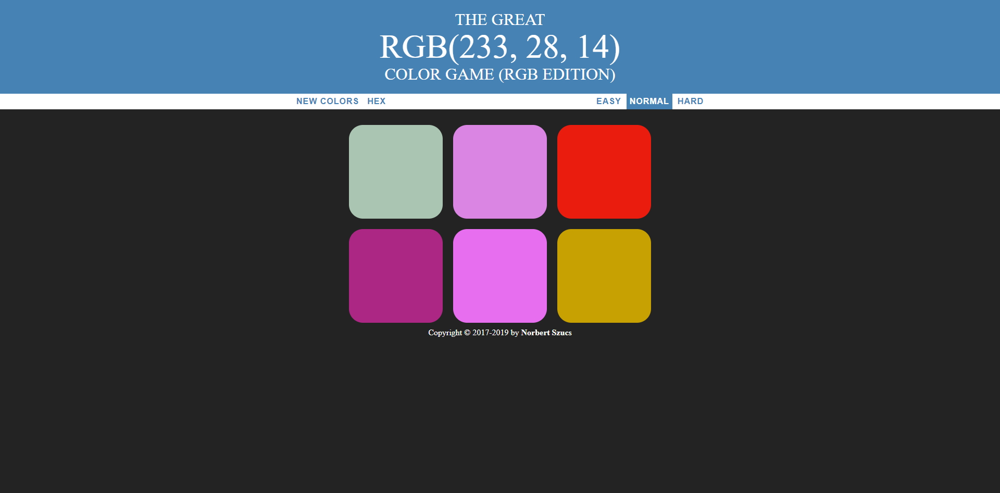
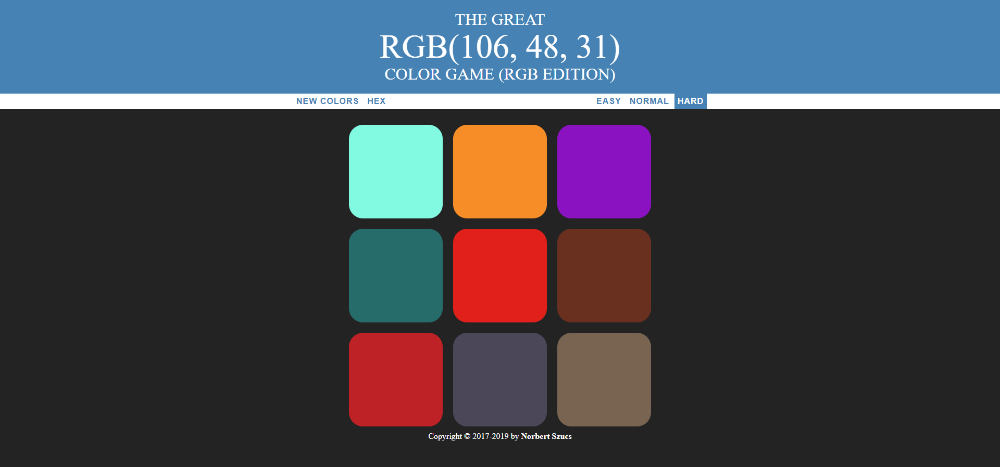
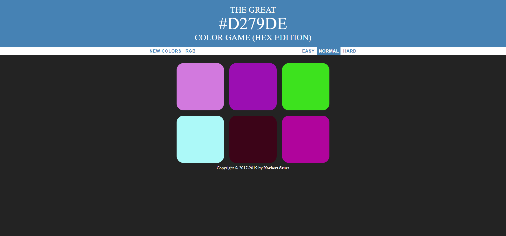

<h1>The Great Color Game</h1>

This is a simple javascript game. It generates a color code (RGB or HEX) and you have to guess which color is it.

<strong>There are 3 difficulty levels:</strong>
<ul>
  <li>Easy (3 choices)</li>
  <li>Normal (6 choices)</li>
  <li>Hard (9 choices)</li>
</ul>

<strong>The levels can be seen on the screenshots below:</strong>

[RGB][Easy]

  <kbd>
    
  </kbd>

[RGB][Normal]

  <kbd>
    
  </kbd>

[RGB][Hard]

  <kbd>
    
  </kbd>

[HEX][Normal]

  <kbd>
    
  </kbd>

